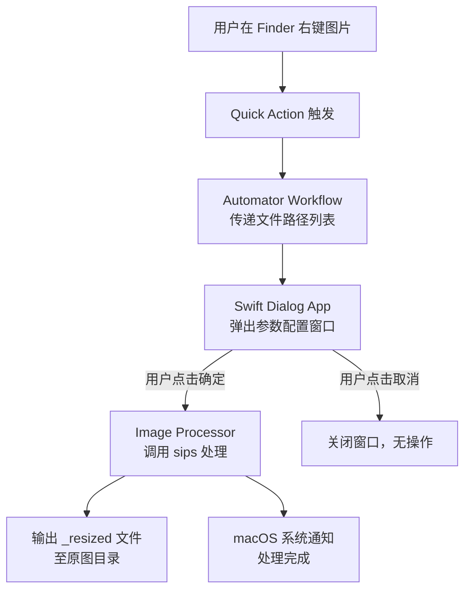

# 技术设计文档：image-resize-tool

## 概述

本工具以 macOS Quick Action（快速操作）的形式集成于 Finder 右键菜单，允许用户对图片文件进行缩放和压缩处理。整体架构分为三层：

1. **Quick Action 入口层**：Automator Workflow，负责接收 Finder 传入的文件路径并启动 Swift 弹窗应用。
2. **UI 层**：Swift AppKit 弹窗应用，提供原生 macOS 风格的参数配置界面。
3. **图片处理层**：调用 macOS 内置 `sips` 命令行工具执行缩放与压缩。

处理结果保存为新文件（`原文件名_resized.扩展名`），原图不受影响，无需持久化配置。



---

## 架构

### 整体架构

采用 **Automator Workflow + 独立 Swift 应用** 的组合方案：

- **Automator Workflow**（`.workflow` 文件）：安装于 `~/Library/Services/`，作为 Quick Action 入口。通过 "Run Shell Script" 步骤将选中文件路径传递给 Swift 应用。
- **Swift Dialog App**（命令行可执行文件或 `.app`）：接收文件路径参数，展示 AppKit 弹窗，收集用户参数后调用图片处理逻辑。
- **sips**：macOS 内置图片处理工具，无需额外依赖，支持缩放（`--resampleWidth`/`--resampleHeight`）和 JPEG 质量设置（`--setProperty formatOptions`）。

### 为何选择此方案

| 方案 | 优点 | 缺点 |
|------|------|------|
| Automator + Shell Script | 简单，无需编译 | UI 能力弱，无法实现原生弹窗 |
| **Automator + Swift App（本方案）** | 原生 UI，可维护性强 | 需要编译 Swift |
| 纯 Swift App Extension | 最原生 | 需要 App Store 签名，复杂度高 |

### 文件结构

```
image-resize-tool/
├── ImageResizeTool.workflow/          # Automator Quick Action
│   └── Contents/
│       ├── Info.plist                 # 声明支持的文件类型
│       └── document.wflow             # Workflow 定义
├── ImageResizeDialog/                 # Swift 弹窗应用
│   ├── main.swift                     # 入口，解析参数，启动 NSApplication
│   ├── AppDelegate.swift              # NSApplicationDelegate
│   ├── ResizeDialogController.swift   # 主弹窗 NSWindowController
│   ├── ImageProcessor.swift           # 图片处理逻辑（调用 sips）
│   └── Models.swift                   # 数据模型
└── install.sh                         # 安装脚本
```

---

## 组件与接口

### 1. Automator Workflow（Quick Action 入口）

**Info.plist 关键配置：**

```xml
<key>NSRequiredContext</key>
<dict>
    <key>NSApplicationIdentifier</key>
    <string>com.apple.finder</string>
</dict>
<key>NSSendFileTypes</key>
<array>
    <string>public.jpeg</string>
    <string>public.png</string>
    <string>public.tiff</string>
    <string>public.heic</string>
    <string>org.webmproject.webp</string>
</array>
```

**Shell Script 步骤：**

```bash
# 将选中文件路径（换行分隔）传递给 Swift 应用
while IFS= read -r file; do
    files+=("$file")
done

/path/to/ImageResizeDialog "${files[@]}"
```

### 2. ResizeDialogController（UI 层）

负责展示 NSPanel 弹窗，包含以下 UI 元素：

- `NSTextField`（只读）：显示文件名 / "已选择 N 张图片"
- `NSPopUpButton`：预设下拉菜单（25% / 33% / 50% / 100% / 自定义）
- `NSTextField`（宽输入框）+ `NSTextField`（高输入框）：自定义尺寸输入，默认隐藏
- `NSButton`（复选框）：是否压缩，默认选中
- `NSButton`（确定）+ `NSButton`（取消）
- `NSProgressIndicator`：处理中进度指示器

**关键接口：**

```swift
class ResizeDialogController: NSWindowController {
    // 初始化，传入待处理文件列表
    init(files: [URL])
    
    // 预设选择变更
    @IBAction func presetChanged(_ sender: NSPopUpButton)
    
    // 宽度输入变更（触发高度联动）
    @IBAction func widthChanged(_ sender: NSTextField)
    
    // 高度输入变更（触发宽度联动）
    @IBAction func heightChanged(_ sender: NSTextField)
    
    // 确定按钮
    @IBAction func confirmAction(_ sender: NSButton)
    
    // 取消按钮
    @IBAction func cancelAction(_ sender: NSButton)
}
```

### 3. ImageProcessor（图片处理层）

封装 `sips` 命令调用，提供同步处理接口：

```swift
struct ProcessConfig {
    let resizeMode: ResizeMode
    let compress: Bool
}

enum ResizeMode {
    case preset(percentage: Double)   // 25/33/50/100
    case custom(width: Int, height: Int)
}

struct ProcessResult {
    let sourceURL: URL
    let outputURL: URL?
    let error: ProcessingError?
}

class ImageProcessor {
    // 处理单张图片，返回结果
    func process(file: URL, config: ProcessConfig) -> ProcessResult
    
    // 批量处理，返回所有结果
    func processBatch(files: [URL], config: ProcessConfig, 
                      progress: (Int, Int) -> Void) -> [ProcessResult]
    
    // 生成输出文件路径（处理命名冲突）
    func outputURL(for sourceURL: URL) -> URL
    
    // 读取图片原始尺寸（用于宽高比联动）
    func imageSize(for url: URL) -> CGSize?
}
```

### 4. 宽高比联动逻辑

当用户输入宽度时，自动计算高度（反之亦然）：

```swift
// 计算联动值
func calculateLinkedDimension(input: Int, inputIsWidth: Bool, 
                               originalSize: CGSize) -> Int {
    let ratio = originalSize.width / originalSize.height
    if inputIsWidth {
        return Int((Double(input) / ratio).rounded())
    } else {
        return Int((Double(input) * ratio).rounded())
    }
}
```

多文件时，以第一张图片的宽高比作为联动基准。

---

## 数据模型

```swift
// 预设枚举
enum Preset: String, CaseIterable {
    case p25  = "25%"
    case p33  = "33%"
    case p50  = "50%"
    case p100 = "100%"
    case custom = "自定义"
    
    var percentage: Double? {
        switch self {
        case .p25:  return 0.25
        case .p33:  return 0.33
        case .p50:  return 0.50
        case .p100: return 1.00
        case .custom: return nil
        }
    }
}

// 处理配置
struct ProcessConfig {
    let resizeMode: ResizeMode
    let compress: Bool
}

enum ResizeMode: Equatable {
    case preset(percentage: Double)
    case custom(width: Int, height: Int)
}

// 处理结果
struct ProcessResult {
    let sourceURL: URL
    let outputURL: URL?
    let error: ProcessingError?
    
    var succeeded: Bool { error == nil }
}

// 错误类型
enum ProcessingError: Error, Equatable {
    case invalidInput(String)
    case fileNotFound(URL)
    case writePermissionDenied(URL)
    case sipsExecutionFailed(exitCode: Int32, stderr: String)
    case unsupportedFormat(String)
}

// 验证状态
enum ValidationState: Equatable {
    case valid
    case empty
    case invalidFormat       // 非正整数
    case exceedsMaximum      // > 32767
}
```

### sips 命令映射

| 操作 | sips 命令 |
|------|-----------|
| 按百分比缩放 | `sips -Z {maxDim} input.jpg --out output.jpg`（先计算目标尺寸） |
| 按宽高缩放 | `sips --resampleWidth {w} --resampleHeight {h} input.jpg --out output.jpg` |
| JPEG 质量 75 | `sips --setProperty formatOptions 75 output.jpg` |
| PNG 无损优化 | `sips` 本身不支持 PNG 压缩优化，改用 `pngcrush -ow output.png` 或直接输出（PNG 已是无损） |

> **设计决策**：PNG "无损压缩优化" 使用 macOS 内置的 `pngcrush`（位于 Xcode 工具链）或退化为直接输出。若 `pngcrush` 不可用，PNG 文件直接以 sips 输出，不额外压缩。

---

## 正确性属性

*属性（Property）是在系统所有有效执行中都应成立的特征或行为——本质上是对系统应做什么的形式化陈述。属性是人类可读规范与机器可验证正确性保证之间的桥梁。*


### 属性 1：标题文本生成

*对任意* 文件 URL 列表，`generateDialogTitle(files:)` 函数生成的标题字符串应满足：单文件时包含该文件的文件名，多文件时包含文件数量 N。

**验证：需求 2.2**

---

### 属性 2：非正整数输入验证

*对任意* 不能被解析为正整数的字符串（包括空字符串、负数、零、小数、含字母的字符串），`validateDimension(_:)` 函数应返回 `.invalidFormat` 或 `.empty` 状态，而非 `.valid`。

**验证：需求 3.1**

---

### 属性 3：超出最大值输入验证

*对任意* 大于 32767 的整数字符串，`validateDimension(_:)` 函数应返回 `.exceedsMaximum` 状态。

**验证：需求 3.2**

---

### 属性 4：确定按钮可用性

*对任意* 验证状态组合，`isConfirmEnabled(preset:widthState:heightState:)` 函数应满足：当且仅当所有相关输入均为 `.valid` 状态（且自定义模式下宽高均非空）时返回 `true`，否则返回 `false`。

**验证：需求 3.3、3.4**

---

### 属性 5：宽高比联动计算（双向）

*对任意* 正整数输入值和任意正数原始宽高比（width/height），`calculateLinkedDimension(input:inputIsWidth:originalSize:)` 函数的返回值应满足：`result / input ≈ originalSize.height / originalSize.width`（输入为宽时）或 `result / input ≈ originalSize.width / originalSize.height`（输入为高时），误差不超过 1 像素（四舍五入）。

**验证：需求 3.5、3.6**

---

### 属性 6：预设百分比目标尺寸计算

*对任意* 正整数原始宽高（width, height）和预设百分比 p（0.25 / 0.33 / 0.50 / 1.00），`calculateTargetSize(originalSize:percentage:)` 函数的返回值应满足：`targetWidth ≈ width * p` 且 `targetHeight ≈ height * p`，误差不超过 1 像素（四舍五入）。

**验证：需求 4.2**

---

### 属性 7：sips 压缩参数构建

*对任意* `ProcessConfig`，`buildSipsArguments(config:inputPath:outputPath:)` 函数生成的参数列表应满足：当 `compress == true` 且格式为 JPEG 时，参数列表包含 `formatOptions 75`；当 `compress == false` 时，参数列表不包含 `formatOptions`。

**验证：需求 4.4、4.5**

---

### 属性 8：输出路径规则

*对任意* 有效文件 URL（无命名冲突），`outputURL(for:)` 函数的返回值应同时满足：
- 输出路径的目录部分与输入路径相同（同目录）
- 输出文件名符合 `{stem}_resized.{ext}` 格式
- 输出文件扩展名与输入文件扩展名相同

**验证：需求 5.1、5.2、5.4**

---

### 属性 9：命名冲突处理

*对任意* 文件 URL 列表（可能包含已存在的 `_resized` 文件），`outputURL(for:existingPaths:)` 函数对列表中每个文件返回的输出路径应互不相同，且不与任何已存在路径冲突。

**验证：需求 5.3、5.5**

---

### 属性 10：错误摘要生成

*对任意* 包含至少一个失败结果的 `[ProcessResult]` 列表，`generateErrorSummary(results:)` 函数生成的摘要字符串应包含每个失败结果的源文件名。

**验证：需求 6.3**

---

## 错误处理

### 错误分类与处理策略

| 错误类型 | 触发条件 | 处理方式 |
|----------|----------|----------|
| `invalidInput` | 用户输入非正整数或超出范围 | UI 层实时验证，禁用确定按钮，显示红色提示 |
| `fileNotFound` | 文件在处理时已被删除/移动 | 记录到错误摘要，继续处理其他文件 |
| `writePermissionDenied` | 目标目录无写权限 | 弹窗显示"无法写入目标目录，请检查权限" |
| `sipsExecutionFailed` | sips 命令返回非零退出码 | 记录 stderr 到错误摘要 |
| `unsupportedFormat` | 文件格式不受 sips 支持 | 记录到错误摘要，跳过该文件 |

### 批处理错误策略

采用"尽力而为"策略：单张图片失败不中断整体处理，所有图片处理完成后统一展示错误摘要。

```swift
// 错误摘要格式
// 成功：关闭弹窗 + 系统通知"处理完成，已生成 N 张图片"
// 部分失败：保持弹窗，显示：
//   "处理完成：成功 M 张，失败 N 张
//    失败文件：
//    - photo.jpg：sips 执行失败（exit code 1）
//    - image.heic：不支持的格式"
```

---

## 测试策略

### 双轨测试方法

本功能同时采用**单元测试**和**属性测试**：

- **单元测试**：验证具体示例、边界条件和错误场景
- **属性测试**：验证跨输入空间的普遍属性（属性 1-10）

### 属性测试配置

- 使用 **SwiftCheck**（Swift 的属性测试库）
- 每个属性测试最少运行 **100 次迭代**
- 每个属性测试用注释标注对应设计属性：
  ```swift
  // Feature: image-resize-tool, Property 5: 宽高比联动计算（双向）
  property("宽高比联动计算保持比例") <- forAll { ... }
  ```

### 测试分层

```
单元测试（XCTest）
├── 纯函数逻辑（属性 1-10 对应的函数）
│   ├── generateDialogTitle
│   ├── validateDimension
│   ├── isConfirmEnabled
│   ├── calculateLinkedDimension
│   ├── calculateTargetSize
│   ├── buildSipsArguments
│   ├── outputURL(for:)
│   └── generateErrorSummary
├── 边界条件示例测试
│   ├── 空文件列表
│   ├── 文件名含特殊字符
│   └── 宽高比为 1:1 的正方形图片
└── 错误处理示例测试
    ├── 权限拒绝
    └── sips 执行失败

集成测试（XCTest + 真实文件系统）
├── 端到端处理流程（JPEG、PNG 各一张）
├── 批量处理（3 张图片）
└── 命名冲突处理（预先创建 _resized 文件）

冒烟测试（手动）
├── Quick Action 在 Finder 中正确显示
├── 弹窗在 500ms 内出现
└── 系统通知正确发送
```

### 不适用属性测试的部分

以下场景使用集成测试或冒烟测试替代：
- **Quick Action 注册**（需求 1）：依赖 macOS 系统配置，使用冒烟测试
- **sips 实际执行**（需求 4.1、4.3）：依赖外部工具，使用集成测试
- **系统通知**（需求 6.2）：依赖 macOS 通知中心，使用集成测试
- **UI 响应时间**（需求 2.1）：性能测试，手动验证
