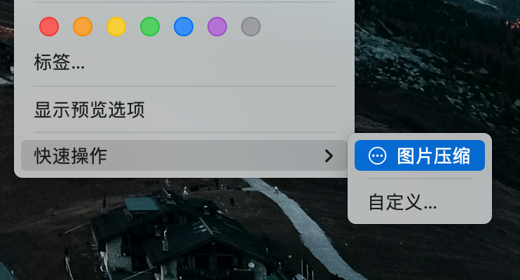
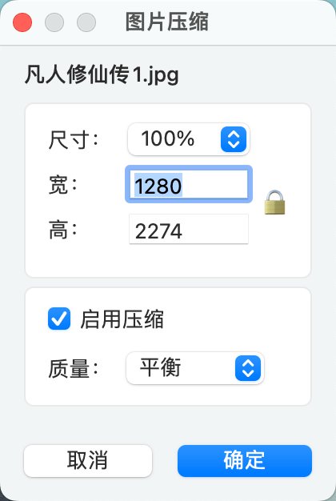

# 图片压缩 - macOS 快速操作

一个通过右键菜单快速操作实现图片压缩和尺寸调整的Mac工具。


## ✨ 特性

- 🚀 **操作方便** - 右键菜单 → 快速操作 → 图片压缩
- 🔧 **灵活配置** - 支持预设比例和自定义尺寸
- 💾 **智能压缩** - 可选压缩率
- 📊 **批量处理** - 支持同时处理多张图片
- 🌓 **深色模式** - 适配 macOS 深色/浅色模式

## 📖 使用方法

1. 在 Finder 中选择一张或多张图片
2. 点击右键
3. 选择 **快速操作 → 图片压缩**
4. 在弹出的对话框中：
   - 设置图片分辨率
   - 选择是否启用压缩（默认启用）
   - 选择压缩质量（默认平衡档）
5. 点击"确定"开始处理
6. 处理完成的图片保存在原图同目录，文件名为 `原文件名_resized.jpg`




## 🚀 安装&卸载

### 使用 PKG 安装包

1. 下载最新的 [图片压缩-1.0.1.pkg](https://github.com/你的用户名/图片压缩/releases)
2. 双击 PKG 文件
3. 按照安装向导操作
4. 输入管理员密码
5. 安装完成后立即可用

### 卸载
终端中输入：
```sh
sudo rm -rf "/Library/Services/图片压缩.workflow"
```

## 🤔 可能的问题
安装时提示：无法打开，因为它来自身份不明的开发者。

解决办法：打开系统设置 → 隐私与安全性 → 下滑找到“安全性” → 选择“仍要打开”


## 📄 许可证

MIT License


## 🙏 致谢

- 参考项目：[video-info-action](https://github.com/Gecho-Go/video-info-action)

## 📮 反馈

如有问题或建议，欢迎提交 [Issue](https://github.com/你的用户名/图片压缩/issues)

---

